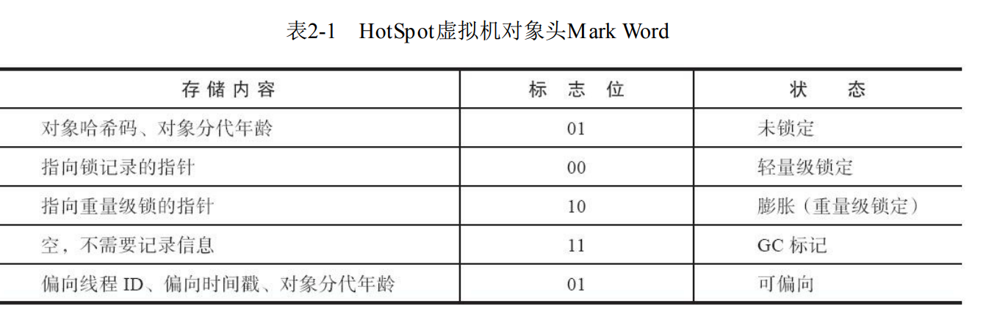

---

### 项目总结


#### 1、线程池

##### 1、池化技术

> **池化技术**：池化技术指的是提前准备一些资源，并分配和组织到对象池中，之后在业务中使用资源时，直接从对象池中获取，使用完了之后再放回到对象池中。
>
> **优点**：
>
> 1. 可以对资源进行重复使用，减少了资源分配和释放过程中的系统损耗，从而提升系统性能；
> 2. 可以对资源的整体使用进行限制
> 3. 可以集中分配，避免出现碎片化问题

---


在数据量很大的情况下，某一时刻可能有大量并发请求，而线程的创建是比较耗时的，如果此时对每个请求都创建一个新的线程，那么会耗费大量时间，造成阻塞。

---


##### 2、创建线程池

```java
ThreadPoolExecutor executor = new ThreadPoolExecutor(
    threadPoolProperties.getCore(), // 核心线程数
    threadPoolProperties.getMax(), // 最大线程数
    threadPoolProperties.getKeepAliveTime(), // 最大空闲时间
    TimeUnit.SECONDS, // 时间单位
    new LinkedBlockingQueue<>(threadPoolProperties.getQueueSize()), // 阻塞队列
    new ThreadFactory() { // 线程工厂
        int i = 0; // 记录线程自增id
        @Override
        public Thread newThread(Runnable r) {
            Thread thread = new Thread(r);
            thread.setName(applicationName + "[core-thread-" + i++ + "]");
            return thread;
        }
    },
    // 拒绝策略【生产环境用 CallerRuns，保证就算线程池满了，不能提交的任务由当前线程自己以同步的方式执行】
    new ThreadPoolExecutor.CallerRunsPolicy()
);
```


---

##### 3、线程池的工作流程

1. 创建线程池，等待请求进行处理
2. 当主线程通过 executor() 方法给线程池提交一个异步任务的时候：
   1. 首先，会判断线程池中的线程数是否达到了核心线程数
      - 如果未达到，则会创建一个新的线程来立即处理当前任务
      - 如果已经达到了核心线程数，则会判断阻塞队列中的任务数是否已经满了
        1. 如果没有满的话，将当前任务添加到阻塞队列中，等其他线程执行完了后，从阻塞队列中取出任务进行执行
        2. 如果阻塞队列已经满了的话，就会判断当前线程数是否达到了最大线程数
           - 如果没有达到最大线程数的话，就会再创建一个新的线程，立即执行当前任务
           - 如果已经达到了最大线程数的话，就会通过指定的拒绝策略来拒绝任务继续添加执行
3. 当一个线程执行完任务后，如果阻塞队列中还有任务的话，会优先执行先添加的任务
4. 如果在一段时间内没有任务执行的话，那么线程池就会判断是否达到了设置的最大空闲时间
   1. 如果达到了的话，就会将超出核心线程数之外的线程进行回收，最后线程池中仍然会保留核心线程数的线程

---

##### 4、项目使用

1. 在 ThreadPool 的 properties 配置类中，通过 `@ConfigurationProperties ` 注解，自动去配置文件中读取配置的线程池参数：
   1. 核心线程数
   2. 最大线程数
   3. 最大空闲时间
   4. 阻塞队列大小
2. 在 ThreadPool 的自动配置类中，通过 `@EnableConfigurationProperties` 注解，将 ThreadPool 的自动配置类自动导入到 Spring 容器；并通过注入配置类中获取的线程池参数创建线程池，然后放到 Spring 容器中；
3. 为了使用方便，可以自定义一个相关的注解 `@EnableThreadPool` ，在这个注解中通过 `@Import` 注解导入创建的自动配置类；
4. 然后在项目中需要使用的服务的启动类上添加自定义的线程池注解即可。

---


#### 2、CompletableFuture 异步编排


> 异步编排 CompletableFuture 是  jdk8 的一个新特性，可以将多个异步任务有序编排起来


**启动异步任务**：

```java
public static CompletableFuture<Void> runAsync(Runnable runnable,
                                               Executor executor) // 返回一个没有当前任务返回值的CompletableFuture
public static <U> CompletableFuture<U> supplyAsync(Supplier<U> supplier,
                                                   Executor executor) // 返回一个有当前任务返回值的CompletableFuture
```

---

**常见的编排任务的方式**

1. thenRun()\thenRunAsync() future.thenXXX():	接下来干什么 CompletableFuture<Void>
   - thenRun(runnable):	不用异步任务，而是使用主线程
   - thenRunAsync(runnable):		用异步跑任务，使用默认 ForkJoin 线程池
   - thenRUnAsync(runnable,executor);        
2. thenAccept()\thenAcceptAsync()： CompletableFuture<Void>
   - thenAccept(consumer):       拿到上一步结果，不用异步跑任务，而是用主线程
   - thenAcceptAsync(consumer):  拿到上一步结果，用异步跑任务，使用默认ForkJoin线程池
   - thenAcceptAsync(consumer,executor)  拿到上一步结果，用异步跑任务，使用指定线程池
3. thenApply()\thenApplyAsync()：  拿到上一步结果，还能自己返回新结果
   - thenApply(function)：        拿到上一步结果，不用异步跑任务，而是用主线程，并返回自己的计算结果
   - thenApplyAsync(function)：   拿到上一步结果，用异步跑任务，用默认线程池，并返回自己的计算结果
   - thenApplyAsync(function,executor)： 拿到上一步结果，用异步跑任务，用指定线程池，并返回自己的计算结果
4. allof()\anyof():
   - allof((CompletableFuture<?>... cfs): 等到所有的任务都执行完成后再继续往下执行
   - anyof((CompletableFuture<?>... cfs):  只要有一个任务执行完成就继续执行，没有执行完的也以异步的方式继续执行

>**总结**：
>
>- thenRun： 不接收上一次结果，无返回值
>- thenAccept：接收上一次结果，无返回值
>- thenApply： 接收上一次结果，有返回值


---

**使用场景**：

在进行对商品详情查询时，可能需要等待上一步查询完了，才能进行下一步查询，因为是同步的，但是有些查询可能不需要上一步的查询结果作为条件；比如我要根据商品的 skuId 查询商品的详细信息，它会包含商品信息、商品图片信息、商品实时价格、销售属性值、sku 组合、分类，但是像商品的实时价格，它的查询条件只需要一个 skuId 即可；而像商品图片信息、销售属性值、sku 组合、分类，他们又需要先根据查询到的商品信息作为查询条件，而他们之间又没有什么先后顺序，那么就可以通过 CompletableFuture 对异步任务进行编排，先根据商品的 skuId 查询商品的详细信息创建一个异步任务 A，另外再创建一个查询商品图片信息的异步任务 B，然后进行异步任务编排，在异步任务 A 上再另起多个异步任务，当 A 执行完成时，执行这些异步任务；然后等到所有的异步任务都执行完了后，将最后的结果返回。 

#### 3、缓存


##### 1、缓存穿透


缓存穿透指的是查询一个不存在的数据时，由于缓存没有命中，此时进行回源查数据库，但是数据库中也没有，又没有将查询的这个空结果存放到缓存中，所以此时缓存就失去了作用，最终的请求都会落到数据库上；那么如果在一段时间内有大量并发请求同时查询这个不存在的数据时，数据库就可能会承受不住大量并发而崩溃。而缓存穿透的这种现象是对的，但是利用这种现象来进行缓存穿透攻击是不对的；所以我们为了防止别人的恶意攻击，可以通过空值缓存+设置过期时间+布隆过滤器/Bitmap 来解决缓存穿透。

---


具体做法就是：首先请求会去缓存中查找这个不存在的数据，由于缓存中没有，那么就会进行回源，而数据库中也没有，那么就向 redis 中存一个这个 id 所对应 key 的空值标识并设置过期时间，然后当请求再次查询时，会先去 redis 中查找，然后从 redis 中获取到数据后，对结果进行判断，如果是之前设置的空值标识的话，说明该数据在数据库中不存在，那么直接返回 null。

当然也可以使用布隆过滤器，当请求过来后，先从缓存中获取，如果获取不到，再问布隆过滤器，如果布隆过滤器判定这个值不存在的话，说明这个数据在数据库中肯定不存在，那么直接返回 null 即可。

---


##### 2、缓存击穿


缓存击穿指的是大量并发查询一个设置了过期时间的热点 key 时，而热点 key 的过期时间正好在此时失效，导致大量并发直接打到数据库，从而可能会导致数据库因为并发压力过大而崩溃。可以通过加锁的方式来解决缓存击穿。


---


##### 3、缓存雪崩

缓存雪崩指的就是大量的设置了过期时间的 key 在大并发请求到来时正好过期，导致大量请求打到数据库。可以通过可以给 key 设置过期时间时加上随机值来解决


---


##### 4、数据不一致

当数据库中的数据发生了更改时，如果没有及时更新缓存中的数据，此时就会出现缓存中的数据与数据库中的数据不一致，那么当后面有请求查询该数据时，从缓存中查到的就是未更新的数据，那么可能就会产生问题。可以通过**设置过期时间+延时双删策略**来解决这个问题。

---


**读模式**：先读缓存，缓存中没有，会去读数据库

---


**写模式**：

1、双写模式

> 在很多场景下，速度慢

1. 改数据库
2. 改缓存


2、失效模式

> 如果优先操作数据库的线程，在操作缓存的时候卡顿，会导致后来的线程优先修改了缓存，出现数据不一致

1. 改数据库
2. 删缓存
3. 当后面有请求获取该数据时，由于缓存中没有，就会去数据库中查，然后放入缓存


3、延时双删+设置缓存过期时间

1. 改数据库
2. 删缓存
3. 提交一个延迟任务（scheduledExecutor.schedule），根据业务场景，指定二次删除的延迟时间【获取使用 Redisson 的分布式异步任务】

---


#### 4、布隆过滤器

> 由一个初值都为零的bit数组和多个哈希函数构成，用来快速判断某个数据是否存在

首先会初始化一个位数组，在初始化状态下，数组中的每一个位都为 0，然后把集合中的每一个元素依次通过多个哈希函数进行映射，每次进行映射都会产生一个哈希值，而这些哈希值会对应位数组上的某些位置，然后把这些位置的值改为 1，那么这个元素在该位数组中的位置就能确定了。

当查询一个元素是否存在时，只需要用同样的方式，将该元素通过多个哈希函数进行映射，如果这些位置的值中有 0 的话，说明该元素在位数组中不存在，但是如果这些位置的值都是 1 的话，该元素可能存在于集合中，因为这样的方式会存在误判，并且随着集合元素的增多，如果还是使用之前的那几个哈希函数的话，那么布隆过滤器的误判次数也会增多；

---


**优点**：高效地插入和查询，占用空间少


**缺点**：

1. 存在误判，不同的数据可能出来相同的hash值
2. 不能删除元素，因为删掉元素会导致误判率增加，因为hash冲突的同一个位置可能存的东西是多个共有的，如果删除一个元素，那么可能也会把其它的删除了
3. 用久了后需要定期重建


**特点**：

1. 布隆过滤器可以添加元素，但是不能删除元素。因为删掉元素会导致误判率增加
2. 误判只会发生在过滤器没有添加过的元素，对于添加过的元素不会发生误判

---


**布隆过滤器是否可以前置？**

> 不可以，因为大多数的请求都是正常请求，一般数据库都会有，缓存中也都会有

1. 所有请求都得先问布隆过滤器，大多数请求会多一次网络交互
2. 会导致系统的吞吐量降低

---


#### 5、分布式锁

##### 1、如何加分布式锁

使用传统的本地锁并不能解决这种分布式场景中出现的问题，因为本地锁它是在各自的微服务本地内存中的对象，只能锁住当前微服务的请求，并不能锁住其他微服务的请求，当然如果对数据的操作要求不是很严格的话，比如这些请求都是读请求，那么其实就算是使用本地锁，那么落到各个微服务上面的话，每个微服务也就对应一个请求，而这些请求再同时访问数据库的话，数据库是可以承受得住的；但是如果对数据的操作要求高的话，又或者说设计到写操作，那么此时使用本地锁就不够用了，就需要使用分布式锁。

------

其实锁的原理都是相同的，本地锁的话，在单体应用中，由于多个线程要访问同一份共享资源，为了防止一个线程在操作共享资源时，其他线程来修改我正在操作的这个共享资源，那么就可以通过加锁的方式保证我一个线程在操作共享资源期间其他线程不能动，只能等我这个线程操作结束后，将锁释放了，其他线程获取到锁，才能够操作；而为了实现这样的效果，就必须保证多个线程获取的锁是同一把锁，这样才能锁住共享资源。所以分布式锁就是将锁对象提升到了一个各个服务都获取的是同一把锁对象的级别，这样就能实现分布式锁。

所以只要能满足上面提到的需求就行，我们可以通过 Redis 的 setnx + expire 来实现；让多个请求执行 setnx 命令，保证只有一个请求加锁执行成功，并设置过期时间，防止出现意外故障而导致锁无法释放。但是这种情况可能会出现抢到锁的线程执行的业务时间超长导致锁过期了该线程还没有执行完，而此时其他线程又抢到了锁，然后上一个线程删的锁是刚进来的线程的锁。所以可以为每一个线程创建一个唯一的线程id，再删除的时候判断要删除的锁是不是自己的锁。但是由于获取值、判断和删除这三个操作无法保证原子性，所以也会有问题，不过可以通过 lua 脚本来执行。

所以如果要自己实现分布式锁的话，可以通过 setnx+expire 通过自旋的方式来实现加锁，并设置当前线程的唯一ID；通过 lua 脚本来实现获取、判断和删除这三个操作的原子性解锁

---

虽然我们可以根据需求自己来实现一个分布式锁，但是像 JUC 中一些其他类型的锁，比如：可重入锁（比如方法A调用方法B，A外面已经加了一把锁，但是在调用B时还需要这把锁，如果是可重入锁的话，此时B就能直接用这把锁，而不需要B再加一把锁；否则的话，B等着A释放锁，A又等着B执行完才能释放锁，就会发生死锁）、公平锁、闭锁（CountDownLatch）、信号量、CycleBarrier，我们不可能再写一套，所以在 Redisson 中就提供了 JUC 所对应的分布式锁。

---

##### 2、使用场景

再通过商品的 skuId 查询商品的详细信息时，我们采用了 Redisson 的分布式锁来防止出现缓存击穿，然后查数据库数据进行回源，将查到的数据再保存到 Redis 中，为了防止出现缓存穿透，我们又使用了 null 值缓存 + 过期时间。

---

##### 3、Redisson 默认加锁特点

1. 名字相同就是同一把锁
2. 锁有自动续期机制，默认是 30s 过期，如果业务超长会自动每过 10s 续期
3. 加锁 + 过期时间 = 加锁原子
4. 得到锁值 + 判断 + 删除锁 = 删除原子
5. Redisson 底层的所有操作都是 lua 脚本完成的，是原子操作

---

##### 4、Redisson 怎么对锁进行续期的？


Redisson 的加锁方式有两种：

1. lock():  
   1. lock(): 阻塞式等锁，一直等，直到获取到锁；获取到锁之后，有自动续期；每过 lockWatchDogTimeOut / 3 会自动续期，续期到 lockWatchDogTimeOut ;
   2. lock(leasetime,TimeUnit): 指定锁的释放时间，阻塞式等锁，一直等，直到获取到锁；获取到锁之后，没有自动续期；等到锁的释放时间到了，锁会自动释放；
2. trylock():
   1. trylock(): 会立即尝试获取锁；获取到了，返回 true；获取不到，返回 false；有自动续期；每过 lockWatchDogTimeOut / 3 会自动续期，续期到 lockWatchDogTimeOut ;
   2. trylock(waitTime,TimeUnit)：在指定的等待时间内，一直尝试获取锁；获取到了，返回 true；获取不到，返回 false；有自动续期；每过 lockWatchDogTimeOut / 3 会自动续期，续期到 lockWatchDogTimeOut ;
   3. trylock(waitTime,leaseTime,TimeUnit): 在指定的等待时间内，一直尝试获取锁；获取到了，返回 true；获取不到，返回 false；没有自动续期；等到锁的释放时间到了，锁会自动释放；

------

其实上面的几种加锁方式都是调用的一个方法：

**private <T> RFuture<Long> tryAcquireAsync(long waitTime, long leaseTime, TimeUnit unit, long threadId)** 

参数：

1. waitTime：等待时间；在指定的等待时间内一直尝试获取锁
2. leaseTime:：锁的释放时间；当获取锁后，会根据设置的锁的释放时间，指定什么时候释放自动锁
3. TimeUnit：时间单位
4. threadId：当前线程 id

------

tryAcquireAsync：

1. 先声明一个异步任务：RFuture<Long> ttlRemainingFuture
2. 判断锁的自动释放时间是否不等于-1？【leaseTime != -1】
   1. 不等于 -1：
      1. ttlRemainingFuture = tryLockInnerAsync(waitTime, **leaseTime**, unit, threadId, RedisCommands.EVAL_LONG);
   2. 等于 -1：
      1. ttlRemainingFuture = tryLockInnerAsync(waitTime, **internalLockLeaseTime,TimeUnit.MILLISECONDS**, threadId, RedisCommands.EVAL_LONG);【internalLockLeaseTime：lockWatchdogTimeout：30s】
      2. 当异步任务执行完成后，会根据 剩余时间、返回值 进行判断：
         1. 如果返回值不为 null，则说明执行完毕，退出；
         2. 如果剩余时间为 null（一开始就是 null ）：
            1. 如果锁的自动释放时间为不等于 -1：
               1. 通过unit 将转换后的锁的自动释放时间设置给 internalLockLeaseTime
            2. 如果锁的自动释放时间为等于 -1：【调用 scheduleExpirationRenewal() ---> renewExpiration() 重新设置释放时间 】
               1. 通过一个时间轮 ，设置当锁的自动释放时间为 internalLockLeaseTime 【lockWatchdogTimeout：30s】/ 3 时，再次设置锁的过期时间为看门狗时间，从而实现锁的自动续期。

---


#### 6、AOP

> AOP：是指在程序运行的过程中，动态地将某段代码切入到指定方法的指定位置处并进行运行的一种编程方式。

由于我们的项目中，在根据商品 skuId 查询商品的详细信息时，整个一套流程就是先从缓存中查，由于我们为了防止出现缓存穿透，所以我们在对数据库中查到数据时，如果发现这个数据在数据库中没有，则会把该 skuId 对应的商品添加到缓存中，以一个特殊的标识表示该商品在数据库中没有，如果查到的是那个代表数据库中没有的标识的话，就直接返回 null，如果缓存中获取不到的话，就再判断布隆过滤器中是否有没有，如果布隆过滤器中判断没有该商品的话，直接返回 null，如果布隆过滤器判断可能存在的话，就要去数据库中进行回源，而为了防止出现缓存击穿，所以，需要加分布式锁，当有请求获取到锁后，进行数据库回源，之后把查到的数据保存到缓存中，然后释放锁，而其他没有获取到的线程会先睡一会，然后直接从缓存中拿，根据缓存中获取的结果直接返回。

---


而上面所说的这类操作，在进行一些其他的查询时也会用到，所以为了降低代码的耦合性，简化这套流程的开发，我们是通过 AOP 对回源的整个前后进行增强。

我们是先自定义一个注解，在这个注解中声明好了【1】缓存时的 key、【2】缓存的过期时间（有默认值）、【3】布隆过滤器的名字、【4】从布隆过滤器中判断的value、【5】还有为了对锁的粒度进行细化的锁的名字，这个注解能被作用的位置（方法上）；然后在对需要进行该场景的方法上添加该注解，在切面中对添加了该注解的方法进行增强（使用的是 Around 环绕通知）

在 Around 通知中，通过 joinPoint 和反射，获取到注解中的各个属性值，根据属性值，完成查缓存、从布隆过滤器中判断商品是否存在、加分布式锁、目标方法【回源】、将查到的数据添加到缓存中、以及释放锁、还有没有获取到锁时睡1s后直接去缓存中查的操作。

同时，为了能够在多个服务中都能应用到这个 AOP 增强，所以，通过一个自定义的 starter，将相关的代码封装进去，之后，哪个服务要使用这个功能了，就直接引入这个 starter 就行了。


---

#### 7、Elasticsearch


##### 1、配置 ik 中文分词器


> 将解压好的插件复制到 ES 容器内部的：/usr/share/elasticsearch/plugins  目录，重启 ES 容器即可


---

##### 2、Elasticsearch 的基本概念


> 为了更好理解，可以与 MySQL 数据进行对比：

|     **MySQL**      |      **Elasticsearch**       |
| :----------------: | :--------------------------: |
| 数据库（database） |        索引（index）         |
|    表（table）     | 类型（type）【7过期、8废弃】 |
|   记录（record）   |       文档（document）       |
|         列         |             属性             |


> 为什么 ES 检索快？


**正排索引**：


在搜索引擎中每个文档都对应有一个文档 ID，文档内容被表示为一系列关键词的集合，每个关键词又对应一个唯一的关键词 ID。比如一个文档，经过分词后，提取了 20 个关键词，每个关键词都有对应的关键词 ID，同时它还会记录它在哪些文档中出现的次数和位置。它是文档集合中找对应的关键词，那么此时就需要扫描索引库中所有的文档，但是这样速度太慢，无法满足实际需求。

正排索引的结构：文档 ID > 单词1：出现的次数，出现位置列表；单词2：出现次数，出现位置列表；......


**倒排索引**：

把之前的文档 ID 对应到关键词的映射转为关键词到文件 ID 的映射，每个关键词都对应着一系列文档，这些文档被称为文档集合。它是从对应的关键词去找对应的文档集合。

倒排索引的结构：关键词1 > 文档1的文档 ID ，文档2的文档 ID


---


> 可以通过 "单词-文档矩阵" 的概念模型来表达二者之间的关系：行为关键词、列为文档

那么：从纵向的维度（文档）来看的话，可以知道该文档对应了哪些关键词；从横向维度看（关键词）来看的话，可以知道该关键词在哪些文档出现过。

> **倒排索引就是实现 "单词-文档矩阵" 的一种具体存储形式；倒排索引主要由两个部分组成："单词词典"、"倒排文件"**


---


从存储的位置上看的话，多个关键词会组成一个词典，在内存中；而某个关键词对应的文档集合和关键词在文档中出现的位置信息这样的一个记录就称为一个倒排项，多个倒排项又构成了倒排列表；所有单词的倒排列表往往顺序地存储在磁盘的某个文件中，这个文件被称为倒排文件。


---


> ES 的倒排索引结构可以适用于快速检索，将搜索到的记录进行相关性评分


---

##### 3、配置远程词库


1. 在nginx的html文件夹下写一个 mydic.dic 词库文件。保证能被访问
2. 配置 ik 使用扩展远程词库（ik/config/IKAnalyzer.cfg.xml ），指定远程分词库（文件）路径
3. 重启 ES

---


##### 4、测试：


**测试远程词库**：

```http
GET /_analyze
{
  "text": "殷存渝",
  "analyzer": "ik_smart"
}
```

---


##### 5、Elasticsearch 自动配置原理


1、引入自动配置

2、在主启动类上添加 ：@EnableElasticsearchRepositories 注解

3、自动配置类分析：

> 1、ElasticsearchDataAutoConfiguration：
>
> 通过 @Import 向容器中导入了 ElasticsearchDataConfiguration 类中的：
>
> ​	1）BaseConfiguration：ElasticsearchConverter（转换器，用于对映射对象进行转换）、SimpleElasticsearchMappingContext（进行映射）
>
> ​	2）RestClientConfiguration：ElasticsearchRestTemplate（对 ES 操作的工具类，对 RestHighLevelClient 【ES 原生高阶客户端】的进一步封装）
>
> ​		
>
> 
>
> 2、ElasticsearchRepositoriesAutoConfiguration：
>
> 通过 @Import 向容器中导入了 ElasticsearchRepositoriesRegistrar（仓库注册器）
>
> ​	1）@EnableElasticsearchRepositories 注解：开启 ES 的自动仓库
>
> ​		- ElasticsearchRepositoryConfigExtension
>
> ​			- ElasticsearchRepositoryFactoryBean：仓库工厂
>
> ​				- ElasticsearchQueryLookupStrategy：查找器
>
> ​				| resolveQuery(): ElasticsearchQueryMethod: 去整个项目中找对 ES 进行增删改查的方法，进行自动适配
>
> ​		提供了我们对简单的增删改查进行操作的方式：
>
> ​			- JavaBean（映射）
>
> ​			- XxxRepository: 只需要写接口，就可以完成普通的增删改查方法，类似于 MybatisPlus；对于复杂的写 DSL
>
> 
>
> 3、ElasticsearchRestClientAutoConfiguration：（ES 的客户端自动配置）
>
> 通过 @EnableConfigurationProperties 注解导入了：ElasticsearchRestClientProperties（客户端属性配置）【"spring.elasticsearch.rest"】
>
> 通过 @Import 向容器中导入了 ElasticsearchDataConfiguration 类中的：
>
> ​	1）ElasticsearchRestClientConfigurations（客户端配置类）
>
> ​		RestClientBuilderConfiguration：
>
> ​			- RestClientBuilder：Rest 客户端构建器（通过 ElasticsearchRestClientProperties 中配置的属性来构建）
>
> ​		RestHighLevelClientConfiguration：（通过 RestClientBuilder 构建出来的）
>
> ​			- RestHighLevelClient：操作原生 ES 的高阶客户端


> **总结**：
>
> 1）普通 CRUD，写 Bean、写接口
>
> 2）复杂 CRUD，ElasticsearchRestTemplate 自己调用相关的方法构造复杂的 DSL 完成功能


---


##### 6、常用操作


1、查看所有的索引

```http
GET _cat/indices
```

2、查看指定索引的映射

```http
GET /person/_mapping
```

3、查询指定索引下，所有的文档数据

```http
GET /person/_search
{
  "query": {
    "match_all": {}
  }
}
```

4、删除索引

```http
DELETE person
```

5、查找指定索引下指定属性值的文档数据

```http
GET /person/_search
{
  "query": {
    "match": {
      "address": "西安"
    }
  }
}
```

6、查询年龄大于 19 且在西安市的人或 id = 1 的人

```http
GET /person/_search
{
  "query": {
    "bool": {
      "should": [
        {
          "bool": {
            "must": [
              {
                "match": {
                  "address": "西安市"
                }
              },
              {
                "range": {
                  "age": {
                    "gt": 19
                  }
                }
              }
            ]
          }
        },
        {
          "match": {
            "id": "1"
          }
        }
      ]
    }
  }
}
```

---


##### 7、DSL 语句

```http
{
    "query":{
        "match-all":{},
        "match":{
            "field": "text"
        },
        "term":{
            "field": "value"
        },
        "bool":{
            "must":[
                {
                	"term":{
                        "field": "value"
                	}
            	},
            	{
                    "bool":{}
            	},
            	{
                    "match":{
                        "field: "text"
                    }
            	},
            	{
                    "nested":{
                        "path": "path_to_nested_doc",
                        "query":{
                            "bool":{
                                "must":[
                                    {
                                        "term":{
                                            "field: "value"
                                        }
                                    },
                                    {
                                        "match":{
                                            "field": "text"
                                        }
                                    },
                                    {
                                        "nested":{
                                            "path": "path_to_nested_doc",
                                            "query":{}
                                        }
                                    }
                                ]
                            }
                        }
                    }
            	}
            ]
        }
    },
    "sort":{
        "field":{
            "order": "desc"
        }
    }
}
```

---


##### 8、Windows 端口冲突

1. jps 查看当前被占用的线程 id （根据端口号查看进程：netstat -aon|findstr 端口号）
2. taskkill /f /pid 进程id

---

##### 9、Java 编写 DSL 语句的步骤

1. 创建 Query，编写 DSL 语句
2. template.search(query,查询结果对应的JavaBean类型.class,要操作那个索引)
3. 将搜索结果进行转换

---

##### 10、项目中的应用

我们的商城项目首页是通过 Elasticsearch 进行全文检索的，而检索的主要信息有：【1】商品的 sku 基本信息、【2】商品的 sku 分类信息、【3】商品的品牌信息、【4】以及商品的 sku 对应的平台属性；

而检索的方式可以是通过搜索栏搜索的关键字、三级分类、商品的品牌、商品的平台属性、以及排序、分页进行检索；

我们会根据请求中的请求参数，编写 DSL 语句，由于要检索的条件很多，所以会通过 bool 进行条件关联，而像属性这种可以有多个参数的情况，会使用 nested 嵌套查询，如果检索的条件中包含关键字的话，会设置高亮；而像品牌这种有分类的情况，会先根据品牌 id 聚合分析，每种品牌又可以再进行品牌名聚合、品牌 logo 聚合；平台属性的话，由于是个集合，所以会进行嵌套聚合。


---

我们的商品上架是先将商品的上架属性修改为上架，然后把从数据库中查询到的商品保存到 Elasticsearch 中。

商品下架是先将商品的下架属性修改为下架，然后把 Elasticsearch 中对应的商品删除。

---


Elasticsearch 中的商品都有哪些属性？

商品详情、品牌信息、分类信息、热度分、还有对应的平台属性

---


#### 8、主从复制

在一些复杂的业务场景中，如果有 SQL 操作导致此次操作锁住了整张表，那么就会导致暂时性的读服务不可用，这样可能会影响业务的正常运行；还有就是对数据库的 IO 访问频率过高，为了缓解数据库的访问频率，可以使用主从复制。

**原理**：主从复制是一个异步的复制过程，它将主库中发生的所有变更记录都保存到一个 binlog 二进制文件中，主库会发送更新事件给从库，而从库会读取更新记录，并执行更新记录，使得从库中的数据与主库中的数据保持一致。

主库：只要有更新事件出现，就会被依次写入到 binlog 里面，之后会推到从库，作为从库进行复制的数据源；每当有从库连接到主库时，主库都会创建一个线程然后发送 binlog 内容到从库。	

从库：在从库中，当复制开始时，从库就会创建两个线程进行处理：当 start slave 在从库执行后，从库就会创建一个 IO 线程，该线程连接到主库并请求主库发送 binlog 里面的更新记录到从库的 relay log （中继日志）文件；从库创建的 SQL 线程会读取relay log 中的更新事件并执行。


---


#### 9、读写分离

> 读写分离是基于主从复制，一个主库有多个从库，主库负责写操作，从库负责读操作；当主库中有数据发生了更改，那么，主库就会自动把数据同步给从库，从而实现主库与从库的读写分离。

---

> 项目中是通过 ShardingJDBC 来完成读写分离配置的。

> 1、如果对主库的数据进行了修改，那么再获取该数据时，可能会出现获取到的数据还是原来的数据，也就是出现了数据未同步的问题，那么可以使用：HintManager.getInstance().setWriteRouteOnly() 来强制从主库中读，从而达到读取最新的数据。

---

#### 10、OpenFeign

> 1、如果对请求的处理的业务时间比较长的话，那么就会出现浏览器访问超时的情况，为了防止这种情况，可以设置 Feign 的超时时间以及重试次数（如果什么都不配置的话，浏览器默认会进行一次重试，算上第一次发的请求，总共会发两次请求）

---


> 2、由于多个项目之间可能会调用同一个远程服务，所以为了避免在各个微服务中重复定义 FeignClient，可以将远程调用的接口都声明在公共模块下，之后每个服务只需要引入功能模块就能正常使用了；可以在主启动类上通过 @EnableFeignClients 指定扫描的 FeignClient 包，防止加载不需要的；

---


> 3、如果在 @FeignClient 中配置了多个调用的服务名相同时，会启动失败，可以配置 spring 中允许 bean 的定义信息覆盖；当然也可以将多个 FeignClient 合并为一个。

---

> 4、使用 OpenFeign 进行远程过程调用时，发现之前浏览器发送的请求中，请求内容在被调用的接口处获取不到了，后面发现，这是因为 OpenFeign 他在进行远程过程调用时，是使用的代理对象进行调用的，这个代理对象是在 ReflectiveFeign 类中声明的，里面通过一个 map，保存了目标方法对应的方法处理器 MethodHandler，而这个方法处理器默认是同步方法处理器;
>
> 也就是说， Feign 在进行远程过程调用时，是一个同步阻塞的过程，调用的方式是通过 JDK的动态代理来完成的；它会根据目标方法的参数构建一个请求模板，这个请求模板里面就保存了定义的请求路径、请求方式，也就是说，在 Feign 进行远程过程调用的时候，它会根据原来的请求，重新构建一个新的请求，并且也可以在 Feign 的远程调用方法的参数位置，通过 Request.Opetions 来给新创建的请求设置一些参数，比如超时时间、重试次数等，而这里进行的配置，它的优先级要高于全局配置的优先级，也就是说，如果某个请求需要定制化处理的时候，就可以通过这个机制，来实现局部远程过程调用参数配置，但是这里发现新的请求模板中并没有原来请求中的请求头等信息。
>
> 而在invoke（） 方法中，可以看到 Feign 就是在这通过循环的方式，不断进行远程过程调用的，这个调用的操作是放在 try 代码块中执行的，它会捕获重试异常，当我们自定义的重试器在指定时间抛出异常时， catch 代码块就会捕获到，从而通过 throw 异常对象的方式来终止循环调用。那么它在执行远程调用之前，会遍历每一个 RequestInterceptor 请求拦截器，然后根据拦截器的 apply（） 方法，对请求进行做最后一次修改，然后获取创建新的请求，之后又会声明一个响应，通过响应去接收请求后的结果。
>
> 因为当一个请求访问 web 服务器时，web 服务器就会分配一个线程去处理，所以我们就可以在当前线程间实现请求的共享，通过给容器中放一个请求拦截器，然后给在请求拦截器的 apply（） 方法中将原来老的请求中的内容添加到请求模板中，而此时又需要原来的请求，原先的做法是通过 ThreadLocal 将每次从网关传过来的请求保存到 ThreadLocal 中，之后在每次从 ThreadLocal中获取后，再将该线程所对应的请求移除防止内存泄漏，当然使用 ConcurrentHashMap 也可以实现这个功能；
>
> 但是后来有同事说这个不用这么麻烦，因为 springmvc 已经提供了这类场景的一个功能，通过 RequestContextHolder 就可以获取到当前线程的请求，此时只需要将原来请求中的请求头等信息保存到请求模板中就行。
>
> 补充：虽然可以将需要的请求以方法参数的形式传递给被调用的接口，但是这种每次传参的方式很没必要


---

#### 11、单点登录

> 单点登录就是在多个应用系统中，用户只需要登录一次就可以访问所有相互信任的应用系统；由于我们的项目是采用微服务架构，每个微服务会处理不同的业务，那么在用户进行一次登录之后，用户在访问其他需要登录的服务时，就不需要再进行重复登录了。


---

> 如果用传统的 session 来保存用户的登录状态的话，在分布式场景下，需要考虑 session 共享问题，而如果要实现 session 共享，那么各个微服务之间就会多了很多进行 session 同步的开销，所以使用 redis 进行单点登录；在用户进行登录时，统一将登录信息发送给用户模块，然后根据用户输出的用户名和 MD5 加密后的密码去数据库中查询，根据查询到的结果，判断用户输出的信息是否正确，如果能查到数据的话，用户登录成功，然后生成一个 token，以指定的字符串为前缀，拼接上生成的 token 作为 redis 中用来保存的 key，保存的值就是查到的用户对象进行 Json 转换后的字符串。接着将 token 返回给前端。那么用户在进行其他需要登录服务的时候，只需要将 token 保存到 Cookie 或者请求头中即可，其他的服务端会根据 token 然后从 redis 中查用户信息，如果能查到的话，说明该用户已经登录了，直接放行，如果没有查到，说明用户还没有登录，则让用户重新登录。

---

#### 12、GateWay

> 在我们的项目中，所有前端发送的请求都会经过网关，所以可以通过网关对不同请求路径的请求进行路由跳转，同时，还可以用来实现统一鉴权处理。因为像【1】 css、js、img 等静态资源是可以直接放行的，【2】而像我们系统内部各个微服务进行暴露的远程过程调用接口是不允许外部进行访问的，我们会通过网关直接拒绝该类请求，给前端响应一个Json 数据提示；【3】如果是一些需要登录才能放行的请求的话，就需要进行权限验证，比如是否登录，因为我们使用的用户登录方式为单点登录，会给登录成功的用户返回一个 token，然后根据 token 把用户的登录信息保存到 redis 中，所以在网关位置就可以对 token 进行验证，如果不能根据 token 从 redis 中查到数据，就证明用户是未登录状态，也可能是用户传的假 token，那么会让浏览器重定向到登录页。
>
> > 由于 GateWay 使用的是 WebFlux 响应式编程，所以它里面是通过一个 exchange 来获取请求和响应的，如果想要实现重定向的话，就需要通过 exchange 来获取响应，然后设置响应的状态码，并且在请求头中添加一个 Location，值就是浏览器要进行重定向的地址；
> >
> > 并且为了解决无限重定向问题，需要我们将原来错误的 token 删除
>
> 如果能从 reddis 中获取到数据的话，说明用户是登录状态，那么为了后期对用户行为进行统计分析，统计用户对应用的服务中访问情况，所以就需要提前知道用户的信息，那么就可以在网关这个位置，获取到用户的id，并且还可以在用户处于登录状态下，进行用户 id 的透传，当然，因为我们的购物车是允许用户在未登录状态下使用的，所以当用户在没有登录时，将某些商品添加到购物车时，前端会给用户生成一个临时 id 放到 请求头或者 Cookie 中，而这个临时 id 它可以保留很长时间，我们定的是半年，也就是说，就算用户登录了，这个临时 id 也会保留，同时我们将用户在未登录状态下购物车中的商品在用户登录时，合并到用户自己的购物车中，然后把临时 id 所对应的购物车清空，所以这里还需要对用户的临时 id 进行透传，将用户 id，临时 id，都保存到请求头中，之后哪些服务需要的话，直接从请求头中获取即可。
>
> 【4】当然，如果是普通请求的话，就会先判断这个 token 是否是有效的 token，如果是无效的话，直接重定向到登录页，否则的话，有用户 id 就透传用户 id，有临时 id 就透传临时 id。

---

#### 13、synchronized 锁升级流程

##### 1、对象的内存布局

对象在堆内存中的内存布局分为三个部分：**对象头、实例数据、对齐填充**；

而**对象头**呢又包含两类信息，**一类是用来存储对象自身的运行时数据**，比如哈希码、GC 分代年龄、锁状态标志、线程持有的锁、偏向线程 ID、偏向时间戳等，这部分数据的长度在 32 位和 64 位的虚拟机中分别为 32 个比特和 64 个比特，官方称它为 "Mark Word"。在 32 位中，在对象未被同步锁锁定的状态下， Mark Word 的 32 个比特存储空间中的 25 个比特用于存储对象哈希码，4 个比特用于存储对象分代年龄，2 个比特用于存储锁标志位，1 个比特固定为 0，在其他状态（轻量级锁定、重量级锁定、GC 标记、可偏向）下对象的内存布局如下：



**对象头的另外一部分是类型指针**，即对象指向它的类型元数据的指针，Java 虚拟机通过这个指针来确定该对象是哪个类的实例。

**实例数据部分是对象真正存储的有效信息**，保存了从父类中继承下来的和自身自定义的各种类型的字段内容。

**对齐填充仅仅起着占位符的作用**，由于 JVM 的自动内存管理系统要求任何对象的大小都必须是 8 字节的整数倍，所以如果对象的实例数据部分没有对齐的话，就需要通过对齐填充来不全。

---

##### 2、synchronized 是什么

> 首先，Java 虚拟机它支持方法级的同步和方法内部一段指令序列的同步，而这两种同步结构都是使用管程（Monitor，也就是锁）来实现的，所以 synchronized 可以作用在方法位置，也可以作用在方法内的某段代码块中。
>
> 而方法级的同步是隐式的，不需要通过字节码指令来控制，它是在方法调用和返回操作来实现的。虚拟机可以根据方法常量池中的方法表结构，看他的 acc_synchronized 访问标志是否被设置，如果设置了，那么线程就需要先持有管程，然后才能执行方法，最后当方法完成时释放管程。而当方法执行期间，如果有线程持有了管程，那么其他任何线程都没有办法再获取到同一个管程。如果一个同步方法执行期间抛出了异常，那这个同步方法所持有的管程会在异常抛出同步方法时自动释放，这也解释了 synchronized 它是自动获取锁，以及自动释放锁。
>
> synchronized 关键字它其实是通过 Java 虚拟机中的 monitorenter 和 monitorexit 这两条指令来支持的，当代码被 javac 编译后，会在 synchronized 所包含的代码前后分别生成 monitorenter 和 monitorexit 两个指令，并且会自动产生一个异常处理程序，它就是用来执行 monitorexit 指令的。
>
> 每一个 Java 对象都可以关联一个 Monitor 对象，而锁升级就是去抢锁的时候去抢对象头的锁标志位

---

##### 3、升级的过程

> 从 JDK 6 开始，默认开启的偏向锁，所以当一个线程将要执行一个被 synchronized 修饰的同步方法或者同步代码块的时候，它会将锁对象的对象头中的 Mark Word 标记的锁状态标记由原来的 00，修改为 01，表示由原来的无锁状态变为现在的偏向锁状态，偏向锁就表示这个锁属于这个线程，任何时候这个线程要锁直接拿，JVM 无需开辟额外的空间或者 CPU 资源维护抢锁信息；当这个线程还没有释放锁时，又有一个线程想要执行，那么此时锁的状态就会从原来的 01 变为 10，锁就会升级为轻量级锁，轻量级锁会让其他想要获取锁的线程自旋等待；而当更多的线程进来时，发现锁状态标志是 10，也进行自旋等待；之后更多的线程进来，锁的标志就会变成 11，此时锁将会升级为重量级锁，内部会让线程 wait 等待；而当第一个线程释放锁后，锁的状态就会变成 00，那么就会通知其他 wait 的线程来抢锁，并且之前自旋的线程也会来抢锁，但是因为自旋的话，它抢锁的速度要更快，所以当某个之前自旋的线程拿到锁之后，锁的状态会改为 01，而其他未获取到锁的线程又会像之前的情况一样，先是自旋，然后是 wait，之后就是这样的一个流程，知道最后一个线程获取到锁后，锁的状态变为 01，当锁释放后，锁的状态又会变为 00，所以锁是没有降级的。

---


#### 14、购物车流程

> **购物车的实现方式**
>
> 我们的购物车是通过 Redis 的 hash 结构来实现的，每一个用户 id 就对应着一个 map，key 就是商品 id，value 是商品信息。
>
> 因为我们的购物车是允许用户在未登录状态下使用的，所以当用户在没有登录时，将某些商品添加到购物车时，前端会给用户生成一个临时 id 放到 请求头或者 Cookie 中，而这个临时 id 它可以保留很长时间，我们定的是半年，也就是说，就算用户登录了，这个临时 id 也会保留，同时我们将用户在未登录状态下购物车中的商品在用户登录时，合并到用户自己的购物车中，然后把临时 id 所对应的购物车清空

>由于我们是跨服务调用的，所以当调用到订单服务时，会接收到传来的商品 id 以及商品个数，那么要给 redis 中添加商品信息的话，就需要获取到用户的 id，而用户的 id 在经过网关的时候，已经进行了 id 透传，将用户 id 保存到了请求头中，但是由于 OpenFeign 的远程调用机制，它会创建一个新的请求，通过这个新的请求进行远程过程调用，那么新的请求中就会丢失掉原来请求的请求头中的用户 id，所以第一种方式就是直接通过方法参数将 用户 id 传过去，当然这种方式每次传不方便。而由于 OpenFeign 他在通过请求模板创建一个新的请求之前，会被 RequestInterceptor 拦截器所拦截，通过拦截器的 apply() 方法可以给请求模板中添加信息，所以第二种方式就是自己写一个 Requestintercepotor 拦截器，在拦截器中获取到原来请求头中的用户 id，然后设置给请求模板，那么之后 OpenFeign 通过请求模板创建的新的请求就可以在请求头中带上我们的用户id。
>
>> 由于 Tomcat 的请求与线程绑定机制，Tomcat 会给每一个请求都分配一个线程进行处理，所以在没有使用异步的情况下，方法的调用栈是每个线程所独有的，那么我们想要在拦截器中获取到请求的话，就可以从同一个线程共享的区域中获取，所以第一反应就是通过 ThreadLocal，把请求都保存到它里面，每次使用后把请求移除，防止内存泄漏；但是后来发现 SpringMVC 已经提供了这样的场景，可以直接通过 RequestContextHolder 获取到当先线程的请求，其实它内部就是通过 ThreadLocal 来实现的。
>
>而由于从请求头中获取用户 id 和临时 id 很频繁，所以可以通过 RequestContextHolder 创建一个工具类，每次想获取的时候，直接通过工具类获取即可。

---


##### 1、向购物车中添加商品

>当用户向购物车中添加商品的时候，又需要考虑用户是否登录、以及用户添加的这个商品是否在购物车中已经存在、还有是否达到了购物车的数量限制（可以是商品品类的数量限制，我们定的是200；还可以是某个商品的数量限制，我们定的还是200个）
>
>【1】首先，前端会传来商品的 id 和这次要添加的数量，那么就要先获取 redis 中的 key 是谁，如果用户 id 存在，说明用户已经登录了，那么 key 就用用户id；如果用户 id 不存在，说明用户没有登录，那么 key 就用临时 id；
>
>【2】接下来就是向购物车中添加商品，先根据key拿到购物车，然后根据商品 id 判断购物车中是否已经有该商品了，并且再获取一下购物车中的商品品类数量；如果购物车中还没有这个商品，就判断我添加了这类商品之后，是否超过最大品类限制，如果超过了就抛异常，如果没有超过，判断该商品的数量会不会超过限制，再根据商品的id，从数据库中查商品的详细信息，然后转为 redis 中要存的商品对象，设置好商品的数量给 redis 中保存起来；**否则**，说明这类商品之前已经有了，那就从数据库中获取商品的最新价格，然后转为 redis 中要保存的对象，设置好价格、数量、更新时间，然后同步到 redis，将商品信息再返回给前端；而在返回之前，还得判断一下，如果用户是未登录状态下，给临时用户的购物车设置一个过期时间，这样一来，过期时间就会从用户最近一次修改购物车开始算起。

---

##### 2、删除购物车中选中的商品

> 【1】先获取到要操作的 key（用户 id 或者临时 id ）；
>
> 【2】然后从 redis 中拿到这个 key 所对应的的购物车；
>
> 【3】对购物车中的商品进行遍历，删除选中的商品

---

##### 3、显示购物车列表

> 购物车的显示是一种什么时候需要，我才给你查的场景

> 【1】根据用户 id 和临时 id，决定用哪个key；
>
> 【2】尝试合并购物车：首先，先判断用户是否登录，如果是登录状态的话，并且临时 id 也存在，那么就进行购物车合并；先获取到临时购物车中的所有商品，如果临时购物车存在，并且购物车中有商品的情况下，进行购物车合并。遍历临时购物车商品列表，获取到每个商品的id、数量，然后调用之前添加商品的方法添加，并且每添加一个，就从临时购物车中删除一个。
>
> 【3】然后再查 key 所对应的商品列表返回；在返回购物车之前，需要把购物车中商品的价格再查一次进行更新，所以需要拿到购物车中的商品列表，然后遍历每个商品，拿到skuId，进行远程调用，查询最新的价格，设置最新价格和修改时间，最后更新 redis 购物车，将购物车列表返回；这是由于在整个系统中，用户的信息很多，我们不可能让用户在登录时把用户的所有状态都更新成最新的数据才给用户登录，这样的话，用户的使用效果就太差了，所以我们采用的是用户要想看关于他的某项信息的时候，才给他去查，在这里显示购物车列表时也是如此，并且考虑到用户的商品数量如果很多，那么按照之前的做法必定要进行很多次的远程调用，这样的话查询效率依旧很低，所以，我们是使用的异步的方式，再更新购物车商品价格的时候，使用异步的方式去更新，而正是这样，所以我们的效果是用户如果刷新一次的话，可能并不会获得最新的结果，但是当用户多刷几次，就能获取到最新的结果了，以此来保证用户的体验。但是这里又有一个问题，就是我们之前为了保证 OpenFeign 发起的远程调用中创建的新的请求中也能有之前请求的请求头，所以我们配置了请求拦截器，在拦截器中要拿到之前的请求，但是这里的请求是一个 null，而出现这种问题的原因是因为 Tomcat 它是一个线程去处理一个请求，由于我们使用了异步，导致开的异步线程不是主线程，所以拿不到主线程中的原来的请求；所以最终解决方式就是在开启异步之前，先从主线程中获取原来的请求，然后在异步线程中，将原来的请求绑定到这个异步线程中，然后在执行更新操作，进行远程调用，更新商品价格，完了之后，为了防止内存泄漏，再手动将异步线程中的请求移除。

---

##### 4、修改购物车中某个商品数量（1或-1）

> 【1】获取到 key；
>
> 【2】根据 key、商品 id，查到商品；
>
> 【3】修改商品数量、修改更新时间；
>
> 【4】保存到数据库

---

##### 5、修改勾选状态

> 【1】获取到 key；
>
> 【2】根据 key、商品 id，查到商品；
>
> 【3】修改商品状态、修改更新时间；
>
> 【4】保存到数据库；

---

##### 6、删除购物车中商品

> 【1】获取到 key；
>
> 【2】根据 key 和 商品 id 删除

---

#### 15、Cookie 和 Session

##### 1、Cookie

> Cookie 是一种客户端会话技术，数据是通过 Cookie 保存在客户端上的

1. 浏览器一旦保存了 Cookie 数据，那么每次请求都会携带这个数据
2. Cookie 默认是当浏览器关闭时 Cookie 中的数据就会被销毁
3. 如果给 Cookie 设置了有效时间的话，那么 Cookie 是否销毁就与浏览器的是否关闭无关了
4. 可以设置 Cookie 的携带路径，指定 Cookie 在哪些路径下携带

---

##### 2、Session

> Session 是服务端的会话技术，数据保存在服务端内存中，服务器会给每一个客户端创意唯一的一个 session 对象（getSession 创建）

---

##### 3、会话的流程

1. 客户端在第一次指定 getSession() 方法的时候，就会开启一个会话，创建一个 HttpSession 对象；
2. 服务端首先会判断 Cookie 中是否存在 JSESSIONID 
   1. 如果存在
      1. 从服务器去找 JSESSIONID 匹配的 session 对象
      2. 找到了，直接返回
      3. 找不到，创建一个新的 session 对象，并设置一个 JSESSIONID 的 Cookie
   2. 如果不存在
      1. 就创建一个 Session 对象，并设置一个 JSESSIONID 的 Cookie
3. 服务器每次创建完 Session 对象，都会将 Session 的 is，保存到 Cookie 中，添加到响应中，保存到客户端
4. 客户端每次请求服务器时都会携带这个 Cookie 数据，服务器就可以根据 Cookie 的 value 值找到对应的 Session 对象

---

#### 16、跨域

##### 1、什么是跨域

> 1. 浏览器发现要发送的 ajax 请求的目标地址和当前所在的服务器不在同一个域（协议：域名：端口号），就会被同源策略限制，请求就会报跨域错误；
> 2. 跨域分简单请求跨域和复杂请求跨域（主要是携带了自定义头等信息），复杂请求跨域会先发送一个预检请求，可以跨域的时候才会发真实请求
> 3. 解决方式：允许各种来源、各种方式、各种头

##### 2、网关配置允许跨域

```yml
spring:
  cloud:
    gateway:
      globalcors:
        cors-configurations:
          '[/**]': #只要有人处理请求了，这个跨域就能生效
            allowedOrigins: "*" #允许所有地址来源跨域
            allowedMethods: "*" #允许所有请求方式跨域
            allowedHeaders: "*" #复杂跨域的原因就是因为带来一些复杂的请求头导致，
            allowCredentials: true #允许带一些安全标致跨域 比如：Cookie
```

